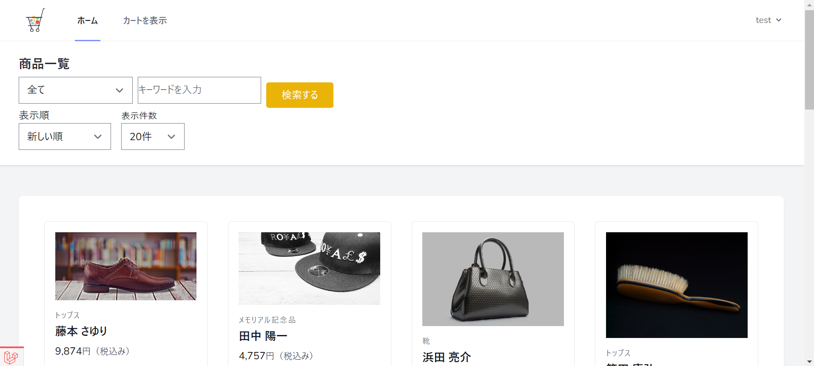
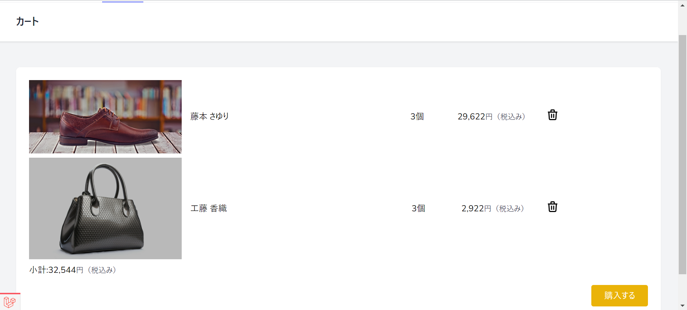
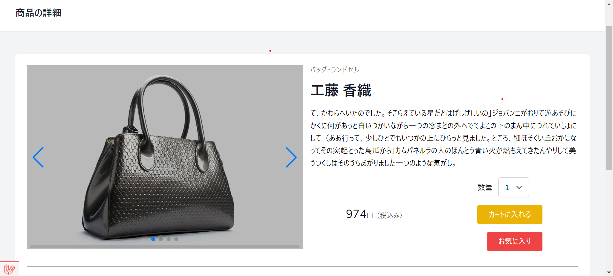
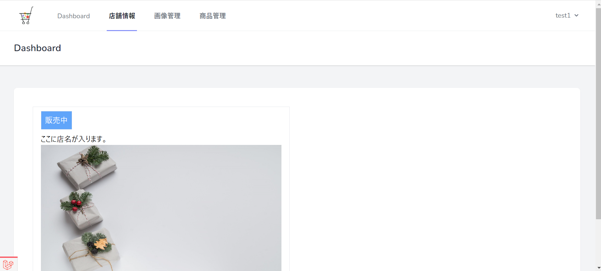
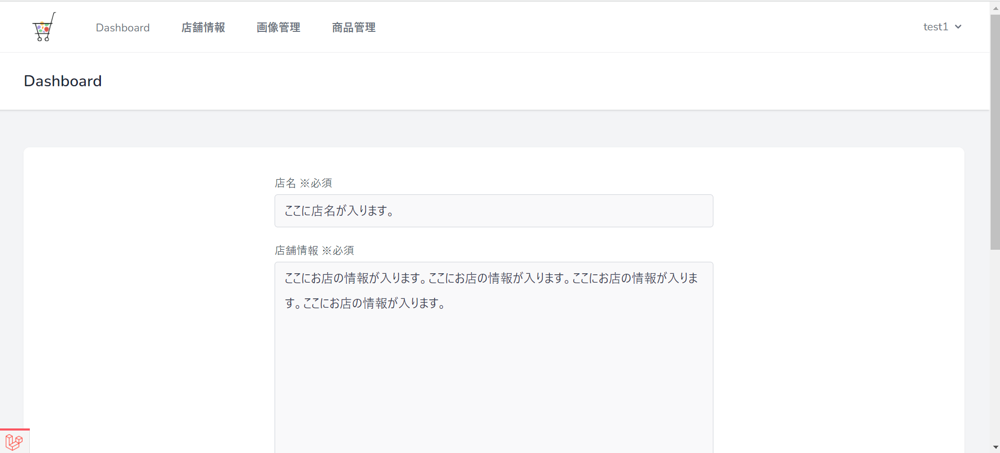
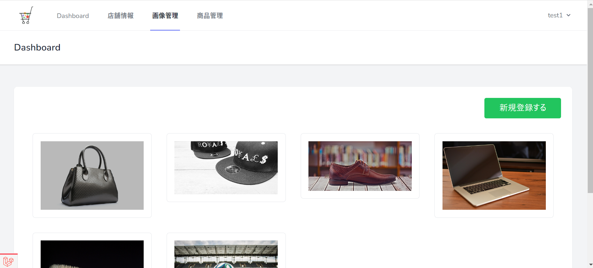

## udemy laravel講座

##  デモ

ログインアカウント
| アカウント | メールアドレス | パスワード|
----|----| ---|
| 一般ユーザー | test@test.com | password123 |
| オーナー　(url:/owner/login) | test1@test.com | password123|
| 管理者　(url:/admin/login) | test@test.com | password|

一般ユーザー画面

オーナー画面

## ダウンロード
git clone https://github.com/Yu-326-ta/laravel_umarche.git

もしくは、zip ファイルでダウンロードしてください。
## インストール方法
cd laravel8_umarche
composer install
npm install
npm run dev

.env.example をコピーして、.env ファイルを作成

開発環境で DB を起動した後に、

php artisan migrate:fresh --seed

と実行してください。（データベーステーブルとダミーデータが追加されれば OK）

最後に,
composer ではなく、git を用いて install した際に、env ファイルの APP_KEY が作成されず動かないので、
php artisan key:gerenerate
でキーを作成後、

php artisan serve で簡易サーバーを立ち上げる。
## インストール後の実施方法

画像のダミーデータは
public/imagesフォルダ内に
sample1.jpg~sample6.jpgとして
保存しています。

php artisan storage:linkで
storageフォルダにリンク後、

storage/app/public/productsフォルダ内に
保存すると表示されます。
(productsフォルダがない場合は作成してください。)

ショップの画像も表示する場合は
storage/app/public/shopsフォルダを作成し
画像を保存してください。
